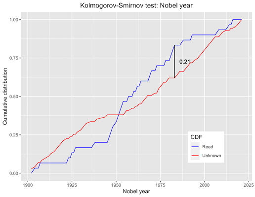

# Nobel literature prizes

## Motivation

I've heard of and read many Nobel literature prize winners, but not others. Some have become obscure with time, some are recent and not really classics yet. Does time of Nobel prize influence what I know about?

## Data

I went through Wikipedia's [list of literature Nobel laureates](https://en.wikipedia.org/wiki/List_of_Nobel_laureates_in_Literature#Laureates) from 1901 through 2021. For each of them, I marked whether I've heard of them, and whether I've read them.

Summary:

|          | Heard of | Not heard of | Total |
|----------|---------:|-------------:|------:|
| Read     |       29 |   1 (really) |    30 |
| Not read |       17 |           71 |    88 |
| Total    |       46 |           78 |   118 |

## Look at me I doin stats

### Binary: known vs unknown

Two groups: Authors I don't know from Adam, vs those I've heard of or read.

There's no obvious pattern in the plot, and indeed **Cohen's d is -0.07**: no effect to speak of.

### Ternary: read vs heard of vs unknown

Three groups: Authors I don't know from Adam, vs those I've only heard of, vs those I've read.

A pattern appears: Looks like I'm likely to have read authors who won the Nobel around the 1950s. This is right smack in the middle of the range, so Cohen's d won't help much, but let's compute it anyway, for funsies:

| Comparison          | Cohen's d |
|---------------------|----------:|
| Read vs unknown     |     -0.06 |
| Read vs heard of    |      0.03 |
| Heard of vs unknown |     -0.08 |

Fat load o' nothing, as expected. Let's bin them by decade and draw a histogram:

Yep, definitely a bump in read authors near 1950, and a corresponding trough in unknown authors. This could be a real effect: Maybe the lack of Nobels during World War 2 means harsher selection for famous authors afterwards. Maybe I'm a 1950s kid. Or could it all be… a coincidence? Dun dun dun.

### Some Russian guys to the rescue

Are Nobel years for authors I read, and those for authors I don't know, drawn from the same random distribution, with this small cluster popping up by sheer chance? Or are those I've read genuinely more concentrated around 1950? The [Kolmogorov-Smirnov test](https://en.wikipedia.org/wiki/Kolmogorov%E2%80%93Smirnov_test) measures exactly that.

The Kolmogorov-Smirnov statistic for Nobel prize authors is **0.21**. …um, okay? Is that a lot or not?

Well, how likely is that to happen if the two distributions are the same? I could compute it, but computations are for computers.

TODO: Monte Carlo go brrr
