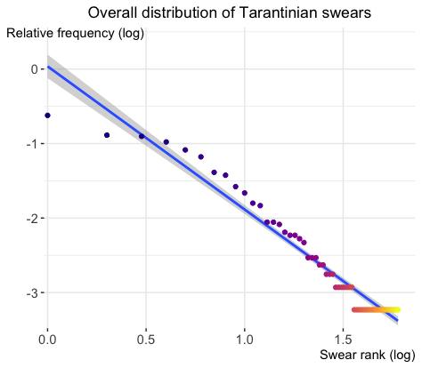

# Tarantino swears

Inexplicably, 538 has a [tally of swears and deaths](https://fivethirtyeight.com/features/complete-catalog-curses-deaths-quentin-tarantino-films/) across all Quentin Tarantino movies. It takes over ten minutes to [say the full list of swears](poetry.mp3).

## What swears are used?

The tally lists **1704 total swears** and **60 unique swears**.

A few of them appear many times: _fucking_ has a comfortable lead with 207 occurrences, nearly a quarter of all swears. It is followed by _shit_ and _fuck_, both used a little over 200 times. Mr. Tarantino's reputation for loving the N-word is borne out by the data: it ranks fourth, with 179 occurrences.

Conversely, 25 swears are said only once, of which my favourite is _cockblockery_, used in _Kill Bill_.

## How is swear frequency distributed?

### Usual word frequency distributions

Word frequency in a corpus often follows a [Zipf](https://en.wikipedia.org/wiki/Zipf%27s_law) or [Yule-Simon](https://en.wikipedia.org/wiki/Yule%E2%80%93Simon_distribution) distribution.

Swear frequency in the Tarantino corpus drops off fast as rank increases, suggesting it may also follow such a law. Let's try to fit Zipf's law:

The fit is very poor: the top swears are much less frequent than Zipf's law would predict. I also tried excluding swears only used once (very noisy, since their frequency is quantised), with little change.

Minimising the square error (in log space) between a Yule-Simon distribution and the actual swear distribution finds a best fit parameter ρ = 0.820.

However, the fit is still poor. Excluding swears used once yields similar results. This shows that Tarentinian swears are not distributed like overall English words.

### Fitting an empirical distribution

It turns out that the rank is proportional to the square log of the frequency. What could produce this? Search me.

